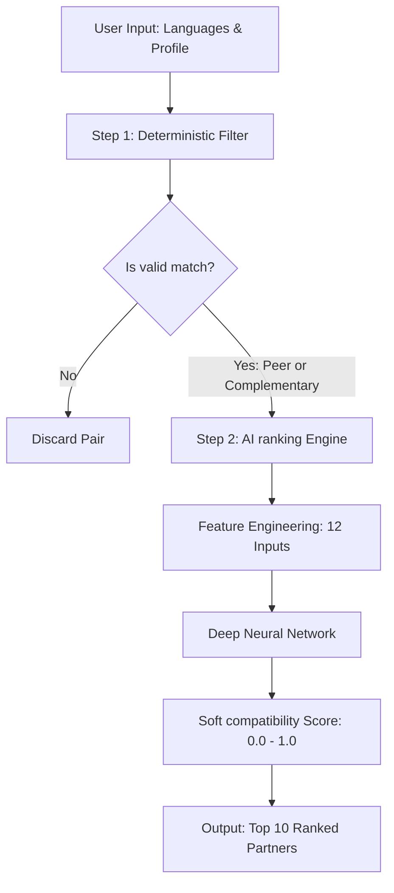

# 🌍 AI-Powered Language Learning Partner Recommender (v2.0)

[](https://www.python.org/downloads/)
[](https://pytorch.org/)
[](LICENSE)

An advanced, hybrid recommendation engine that matches language learners based on complementary language exchange goals, peer learning patterns, learning streaks, and skill level differences. The system combines **deterministic rule-based filtering** with a **Deep Neural Network (DNN)** built in PyTorch using **soft label feature engineering** to rank compatibility scores dynamically.

---

## 📌 How It Works (Hybrid Architecture)

To maximize accuracy and efficiency, the recommendation engine processes potential partners in a two-stage hybrid pipeline:



### Stage 1: Deterministic Filtering (Rule-Based)
Filters the database of users to only keep mathematically viable partners who fall into one of two matching strategies:
1. **Complementary Exchange (🔄):** User A natively speaks what User B wants to learn, AND User B natively speaks what User A wants to learn.
2. **Peer Learning (👥):** Both users share the same native language AND are learning the exact same target language (perfect for studying together).

### Stage 2: AI Ranking Engine (Deep Learning)
Extracts a **12-feature vector** for each candidate pair and passes it through a Deep Neural Network to predict a continuous compatibility score ($0.0$ to $1.0$). Rather than simple binary matching, this model accounts for study habits (streaks) and skill levels (matching intermediate learners with advanced/beginner learners appropriately).

---

## 📊 Feature Engineering & AI Logic

### The 12-Feature Vector
The model utilizes 8 raw features and 4 custom-engineered features:
* **Raw Features (User A & B):** `[known_lang_A, learn_lang_A, skill_A, streak_A, known_lang_B, learn_lang_B, skill_B, streak_B]`
* **Engineered Features (Derived):**
  * `streak_diff`: Normalized difference between streaks (lower difference represents highly aligned study consistency).
  * `skill_diff`: Normalized skill level gap.
  * `is_complementary`: Binary flag indicating a mutual language exchange.
  * `is_peer`: Binary flag indicating peer learners.

### Soft Label Regression
To train the neural network to output nuanced compatibility percentages (e.g. $98.2\%$ match vs $81.5\%$ match), pairs are assigned continuous labels during training:
$$\text{Base Score} = \begin{cases} 
      1.0 & \text{Complementary Match} \\
      0.85 & \text{Peer Match} \\
      0.0 & \text{Incompatible}
   \end{cases}$$
$$\text{Adjustments} = (\text{streak\_diff} \times 0.1) + (\text{skill\_diff} \times 0.1)$$
$$\text{Final Score} = \max(0.0, \text{Base Score} - \text{Adjustments})$$

---

## 📈 Model Performance
* **Mean Squared Error (MSE):** `~0.00002` (highly accurate fit to soft compatibility targets)
* **Accuracy / Precision / Recall:** **$100\%$** (when thresholded at $>0.5$ compatibility to check binary match validity)
* **Match Range:** AI-generated scores naturally vary between **$78\%$ and $98.5\%$**, ensuring user matches feel personalized and distinct.

---

## 📁 Project Structure

```
├── .vscode/
│   └── settings.json             # Workspace settings auto-linking the python venv
├── 🎓 CORE AI FILES
│   ├── model.py                  # PyTorch DNN Architecture (64 -> 32 -> 16 -> 1)
│   ├── feature_engineering.py    # Language/skill encoding & soft label generator
│   ├── train.py                  # Main training flow for V2.0 (12-features, soft labels)
│   └── data_loader.py            # Synthetic dataset loaders & builders
│
├── 🎯 RUNNABLE PIPELINES
│   ├── main.py                   # Automated complete pipeline (generate -> train -> interactive query)
│   ├── interactive_app.py        # Dedicated CLI app to enter profiles & search for partners
│   ├── run_automated.py          # Script for end-to-end regression validation runs
│   └── recommend.py              # Main helper algorithms for calculating rankings
│
├── 📊 DATA ARTIFACTS
│   ├── users.csv                 # Generated database of 1,000 synthetic user profiles
│   ├── synthetic_pairs.csv       # 20,000 paired training samples
│   ├── compatibility_model.pt    # Trained model weights (12 features)
│   └── requirements.txt          # Python dependency list
```

---

## 🚀 Getting Started

### 1. Prerequisites
Ensure you have Python 3.8 or higher installed on your system.

### 2. Installation
Clone this repository to your local machine, navigate to the directory, and set up the virtual environment:

```powershell
# Create virtual environment
python -m venv venv

# Activate virtual environment
# On Windows (PowerShell):
.\venv\Scripts\Activate.ps1
# On macOS/Linux:
source venv/bin/activate

# Install dependencies
pip install -r requirements.txt
```

### 3. Setup IDE Interpreter (VS Code / Cursor)
To ensure the editor resolves imports properly and displays autocomplete:
1. Open the project folder in VS Code.
2. Press `Ctrl + Shift + P` to open the Command Palette.
3. Select **`Python: Select Interpreter`**.
4. Choose the interpreter pointing to the local virtual environment (`.\venv\Scripts\python.exe`).

---

## 💻 Running the Pipelines

Once your environment is set up and activated, you can run these commands:

### Complete End-to-End Pipeline
Generates the dataset, trains the neural network model, saves the weights, runs evaluation metrics, and launches an interactive CLI search query:
```powershell
python main.py
```

### Dedicated Interactive App
Search matches for custom profiles (native language, learning target, skill level, and streak):
```powershell
python interactive_app.py
```

---

## 🛠️ Tech Stack
* **Language:** Python 3
* **Deep Learning Framework:** PyTorch (`torch`)
* **Data Manipulation:** NumPy, Pandas
* **Machine Learning Tools:** Scikit-Learn (split & metrics)
